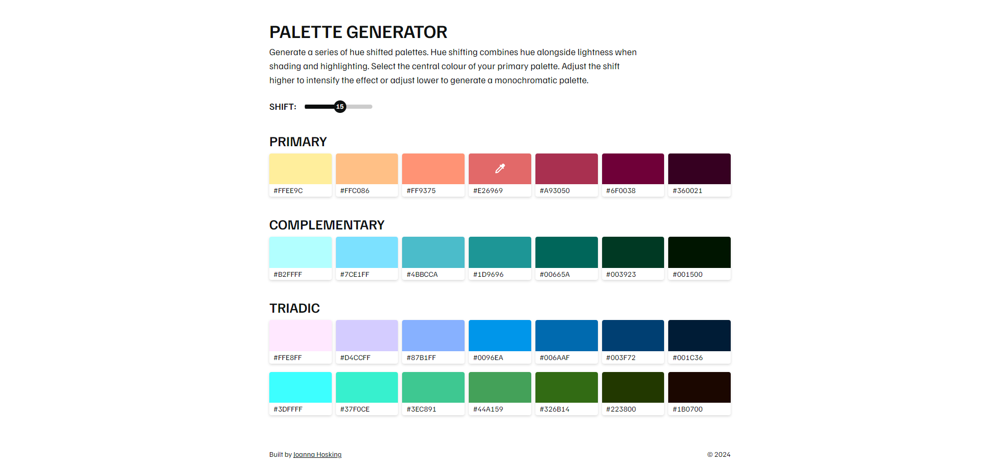
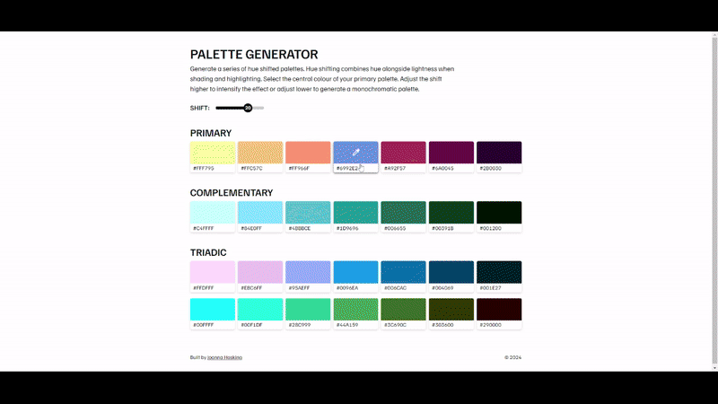

- [View on Github &rarr;](https://github.com/joannahosking/palette-generator)
- [Visit demo &rarr;](https://palette.joannahosking.com/)

As I enjoy pixel art as a hobby, this tool was built in React to assist with making palette choices that would enhance depth and contrast in my projects. While there is much more to [colour theory](https://pixelparmesan.com/color-theory-for-pixel-artists-its-all-relative/), I've found hue shifting to be a good starting point for a novice in building palettes. The general idea is that highlighted areas have warmer values, and shadows have cooler values.

Users are able to control the primary colour and amount of shift, which is dynamically generated by a series of helper functions for both the primary colour and two additional palettes. As the primary colour and shift are adjusted, hex values are generated for the user to copy to their clipboard.

*Shift value adjustment results in more or less monochromatic palettes.*

The project utilises the _chroma-js_ package to calculate the LCH value of the selected colour, then each shade is generated by shifting the hue by the selected step and incrementing the lightness equally. A complementary and triadic palette is also created by adjusting the hue of the primary colour.

*The primary colour is adjusted with an HTML colour input.*

Visually, the colour picker and 'copy to clipboard' icons became an accessibility challenge as a dark or light icon wouldn't meet readability standards toward their respective lightness. Thanks to LCH measuring relative lightness, the swatch component is able to simply measure the lightness value  of each shade and choose an icon fill colour appropriately. This can be seen in the screenshot above.