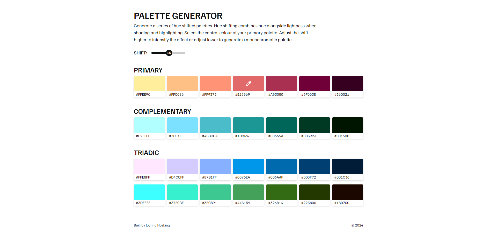
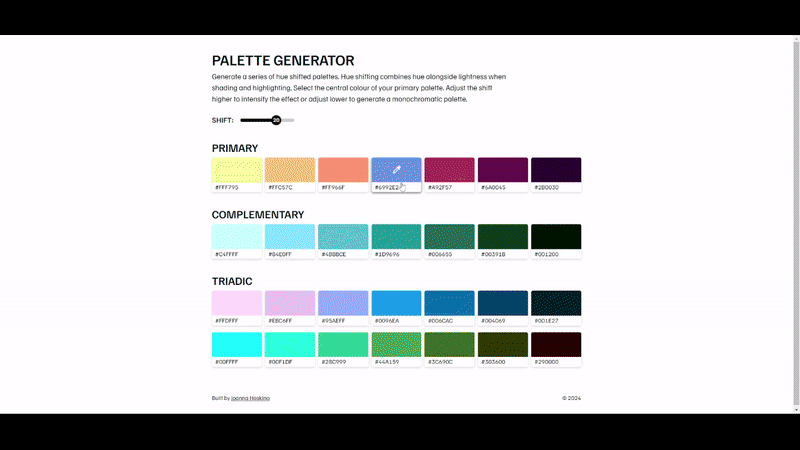

- [View on Github &rarr;](https://github.com/joannahosking/wordle-builder)
- [Visit demo &rarr;](https://wordle.joannahosking.com/)

<!-- As I enjoy pixel art as a hobby, this tool was built in React to assist with making palette choices that would enhance depth and contrast.

Users are able to control the primary colour and amount of shift, which is dynamically generated by a series of helper functions for both the primary colour and two additional palettes. The project uses _chroma-js_ to break down the LCH value of the selected colour, which is then mapped for each shade basic on the selected amount of shift.

*Shift value adjustment results in more or less monochromatic palettes.*

As the primary colour and shift are adjusted, hex values are generated for the user to copy to clipboard. Each colour component also evaluates the accessibility of the "copy to clipboard" icon colour and adjusts if necessary.

*The primary colour is adjusted with an HTML colour input.* -->
