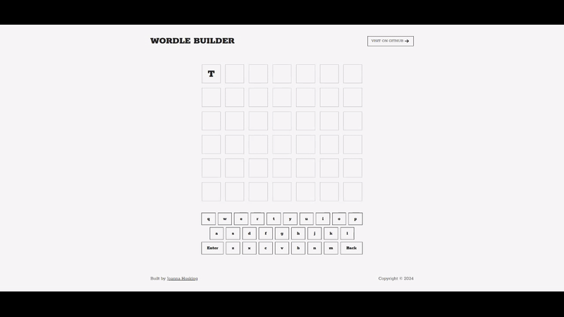

- [View on Github &rarr;](https://github.com/joannahosking/wordle-builder)
- [Visit demo &rarr;](https://wordle.joannahosking.com/)

I generally work with MySQL and more recently SQLite, but I've been interested in learning Postgres and more specifically trying [Supabase](https://supabase.com/). I decided to build a quick Wordle clone as a front end where users can create their own puzzles to share.

Users can submit a word up to 10 characters and select a number of attempts that solvers are allowed. This is assigned a unique ID to use as a slug and stored in the attached database. Originally, I was using Supabase's UUID extension for the unique identifier, but I moved to generating a random string instead to cut down on the string's length.

The URL to the puzzle can be copied and shared. Solvers are prompted with yellow and green blocks as expected. A win prompts _canvas-confetti_ to celebrate the user.

